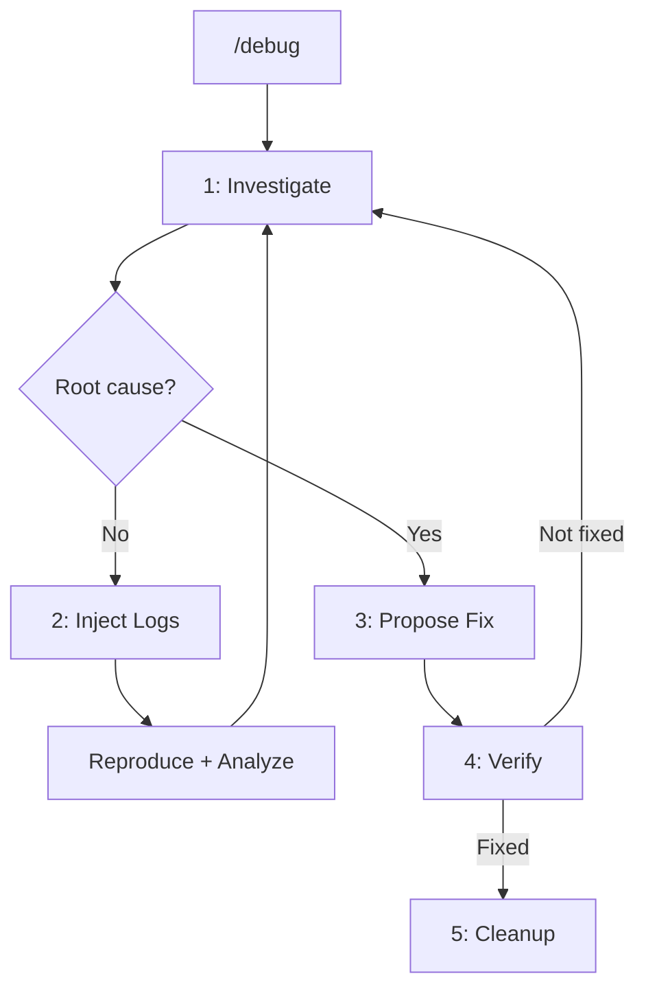

# Debug Tools

Iterative debugging workflow for OpenCode with confidence scoring and optional MCP integration.

## Features

- Code investigation to find root cause
- Confidence scoring for findings (High >= 70, Medium 50-69)
- Strategic log injection with `[DEBUG]` prefix
- Automatic cleanup of debug logs
- Optional MCP integration for enhanced debugging

## Commands

| Command                | Description                       |
| ---------------------- | --------------------------------- |
| `/debug "description"` | Start iterative debugging session |

## Agents

| Agent                 | Description                                    |
| --------------------- | ---------------------------------------------- |
| `@debug-investigator` | Analyzes code for bugs with confidence scoring |
| `@debug-logger`       | Injects and cleans up debug logs               |

## Skills

| Skill       | Description                        |
| ----------- | ---------------------------------- |
| `debugging` | Debugging patterns and log formats |

## Installation

```bash
cp -r debug-tools/commands/* .opencode/commands/
cp -r debug-tools/agents/* .opencode/agents/
cp -r debug-tools/skills/* .opencode/skills/
```

## Quick Start

```bash
# Start debugging session
/debug "user cannot login after page refresh"

# The workflow is conversational:
# 1. Agent investigates and reports findings with confidence scores
# 2. If needed, agent injects debug logs
# 3. You reproduce the bug and share console output
# 4. Agent proposes fix
# 5. You verify and agent cleans up logs
```

## Workflow



### Phases

| Phase          | Description                     | Agent              |
| -------------- | ------------------------------- | ------------------ |
| 1. Investigate | Analyze code, find root cause   | debug-investigator |
| 2. Inject Logs | Add logs at strategic points    | debug-logger       |
| 3. Propose Fix | Suggest minimal correction      | debug-investigator |
| 4. Verify      | User confirms fix works         | -                  |
| 5. Cleanup     | Remove debug logs automatically | debug-logger       |

## Optional MCPs

The plugin works fully without MCPs, but can leverage these optional MCP servers:

### console-ninja

Captures runtime values without manual log injection.

Config in `~/.config/opencode/opencode.json`:

```json
{
  "mcp": {
    "console-ninja": {
      "type": "local",
      "command": ["npx", "-y", "console-ninja-mcp@latest"]
    }
  }
}
```

Without: Uses `console.log("[DEBUG] ...")` fallback

### chrome-devtools

Enables browser console and network inspection.

Config:

```json
{
  "mcp": {
    "chrome-devtools": {
      "type": "local",
      "command": ["npx", "-y", "chrome-devtools-mcp@latest"]
    }
  }
}
```

Without: Manual browser inspection

### serena

Semantic code analysis and symbol navigation.

Config:

```json
{
  "mcp": {
    "serena": {
      "type": "local",
      "command": [
        "uvx",
        "--from",
        "git+https://github.com/oraios/serena",
        "serena",
        "start-mcp-server"
      ]
    }
  }
}
```

Without: Uses `grep` and `read` for code analysis

### context7

Documentation search for debugging patterns.

Config:

```json
{
  "mcp": {
    "context7": {
      "type": "remote",
      "url": "https://mcp.context7.com/mcp"
    }
  }
}
```

Without: Uses `webfetch` for external documentation

## Confidence Scoring

| Score | Meaning               | Action                   |
| ----- | --------------------- | ------------------------ |
| >= 70 | High - clear evidence | Report as probable cause |
| 50-69 | Medium - possible     | Suggest logs to confirm  |
| < 50  | Low - speculation     | Do not report            |

## Log Format

All debug logs use consistent format:

```javascript
console.log("[DEBUG] [file:line] description", { values });
```

- `[DEBUG]` - Prefix for grep and cleanup
- `[file:line]` - Location reference
- `{ values }` - Relevant variable state

## When to Use

- Bug with unexpected behavior
- Silent errors or intermittent failures
- Issues requiring runtime data

## When NOT to Use

- Syntax errors (linter resolves)
- Type errors (TypeScript resolves)
- Obvious bugs in diff (use `/git-review`)

## Agent Configuration

All agents include optimized settings:

| Agent              | Steps | Temperature |
| ------------------ | ----- | ----------- |
| debug-investigator | 15    | 0.1         |
| debug-logger       | 12    | 0.1         |

## Example Session

````
User: /debug "Form submission fails silently"

Agent: Investigating form submission flow...

**[85] Missing error handling**
- File: src/api/submit.ts:42
- Evidence: catch block is empty
- Fix: Add error state update

## Proposed Fix

**Confidence: 85**

Root cause: Error swallowed in catch block

```diff
// src/api/submit.ts:42
catch (error) {
-  // silently ignored
+  setError(error.message);
}
````

Apply this fix?

User: Yes

Agent: Fixed. Please try submitting the form again.

User: Works now!

Agent: Bug resolved.

## Cleanup Complete

Removed 0 debug logs (none were needed).

```

## License

MIT
```
