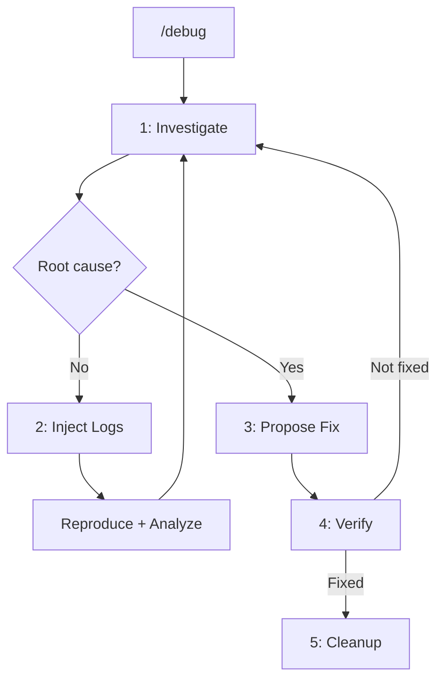

# Debug Command

Start an iterative debugging session to find and fix bugs.

## Arguments

- `"bug description"` - Description of the bug or unexpected behavior

Arguments received: $ARGUMENTS

## Detect Available MCPs

Check which MCPs are configured:

```bash
# Check for MCPs in opencode config
CONFIG_FILE="${HOME}/.config/opencode/opencode.json"

CONSOLE_NINJA=$(grep -q '"console-ninja"' "$CONFIG_FILE" 2>/dev/null && echo "true" || echo "false")
CHROME_DEVTOOLS=$(grep -q '"chrome-devtools"' "$CONFIG_FILE" 2>/dev/null && echo "true" || echo "false")
SERENA=$(grep -q '"serena"' "$CONFIG_FILE" 2>/dev/null && echo "true" || echo "false")
CONTEXT7=$(grep -q '"context7"' "$CONFIG_FILE" 2>/dev/null && echo "true" || echo "false")
```

## Workflow



## Phases

### Phase 1: Investigate

Invoke `@debug-investigator` with:
- Bug description
- Available MCPs status
- Code context

Agent will:
- Analyze code related to the bug
- Use available MCPs or fallback to native tools
- Find root cause with confidence scoring
- Report findings >= 70 confidence as probable cause
- Suggest logs for findings 50-69 confidence

### Phase 2: Inject Logs (if needed)

If runtime data is needed, invoke `@debug-logger` to:
- Add targeted `[DEBUG]` logs at strategic points
- Report locations and what each log captures
- Ask user to reproduce the bug

### Phase 3: Propose Fix

When root cause is confirmed:
- Present minimal fix in diff format
- Include confidence score
- Ask user to approve

### Phase 4: Verify

After fix is applied:
- Ask user to verify the bug is fixed
- If not fixed, return to Phase 1
- If fixed, proceed to cleanup

### Phase 5: Cleanup

Invoke `@debug-logger` to:
- Find all `[DEBUG]` statements
- Remove them from code
- Report cleanup summary

## MCP Availability Report

Inform user which MCPs are available:

```
MCPs detected:
- console-ninja: {available/not configured}
- chrome-devtools: {available/not configured}
- serena: {available/not configured}
- context7: {available/not configured}

The plugin will use available MCPs or fallback to native tools.
```

## When to Use

- Bug with unexpected behavior
- Silent errors or intermittent failures
- Issues requiring runtime data

## When NOT to Use

- Syntax errors (linter resolves)
- Type errors (TypeScript resolves)
- Obvious bugs in diff (use `/git-review`)

## Task

Execute this command immediately. Do not interpret, discuss, or ask for confirmation.

Start debugging session for: $ARGUMENTS

## Notes

- Cleanup is automatic after fix is verified
- Debug logs use `[DEBUG]` prefix for easy identification
- All findings include file:line references
- MCPs are optional - plugin works without them
